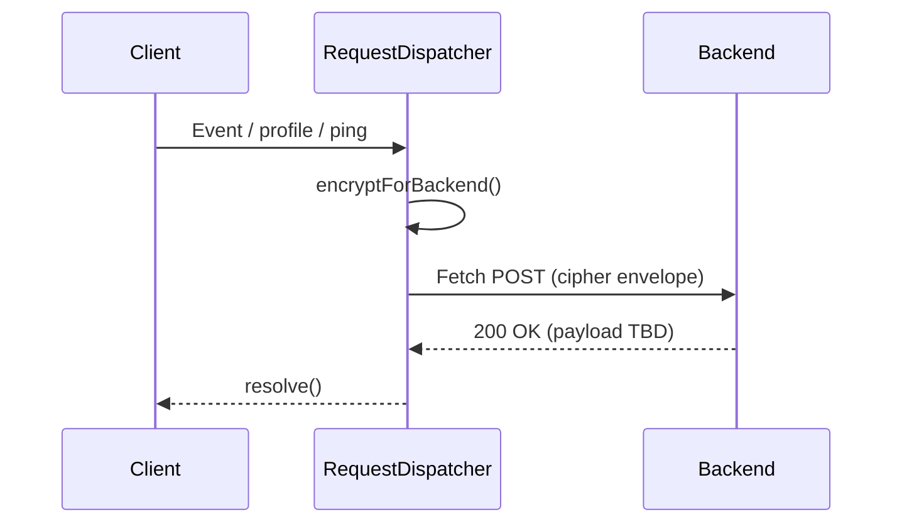
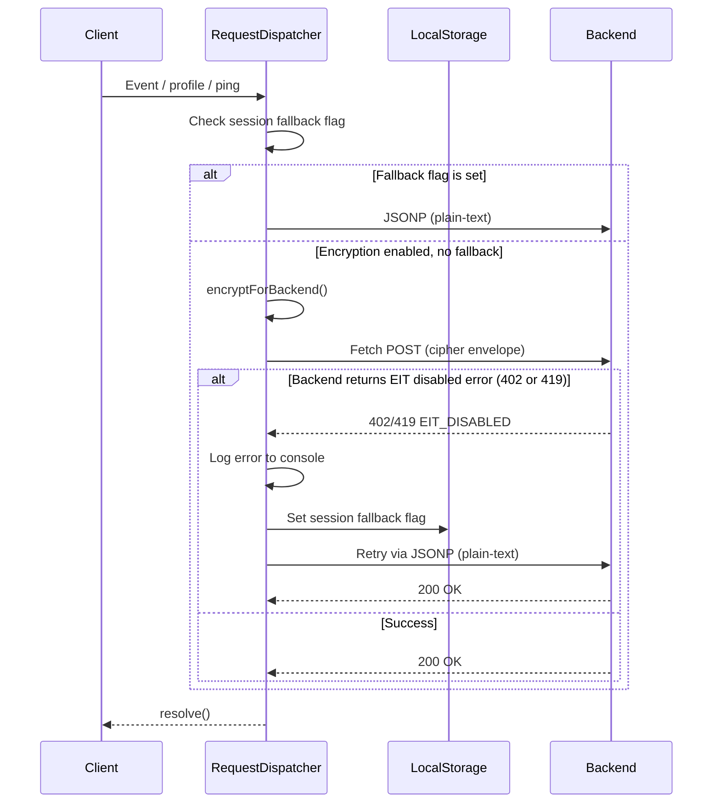

# Encryption in Transit

This document tracks the design & implementation plan for adding **AES-GCM-256 encryption for all outbound payloads** when the feature flag is enabled in the Web SDK.

> ⚠️  Phase 1 covers **sending** encrypted data _to_ the back-end.  
> Phase 2 will cover **receiving / decrypting** encrypted responses and is **out-of-scope for this draft**.

---

## 1. Problem Statement
Today the SDK transmits request bodies in plain-text (optionally compressed). To meet strict security & compliance requirements we must offer **encryption in transit** so that sensitive customer data is protected between browser and CleverTap’s ingress layer.

## 2. Public API Surface
We expose a single runtime API:

```js
clevertap.enableEncryptionInTransit(boolean)
```

* **Default:** `false` for full backward compatibility.
* **Behaviour:** when set to `true` _before_ the first network call, every subsequent request uses Fetch API and transmits an encrypted payload envelope.

Internally a static flag will be stored on `RequestDispatcher` (similar to the new `enableFetchApi` flag).

## 3. Encryption Algorithm
* **Algorithm:** AES-GCM-256
* **Key length:** 32 bytes (256 bits)
* **IV length:** 12 bytes (96 bits) as recommended for GCM
* **Tag length:** 128 bits (built-in to GCM)
* **Encoding:** All binary artefacts (cipher, key, IV) are **base-64** encoded for transport safety.
* **Envelope compression:** Final JSON envelope is compressed using the existing **compress** utility from `src/util/encoder.js`.

```js
// Minimal reference implementation (subject to extraction into util/security/AES.js)
const utf8  = new TextEncoder();
const toB64 = (u8) => btoa(String.fromCharCode(...u8));
const rnd   = (n) => crypto.getRandomValues(new Uint8Array(n));

function encryptForBackend(payload, { id = 'ZWW-WWW-WWRZ' } = {}) {
  const key = rnd(32);            // 256-bit key
  const iv  = rnd(12);            // 96-bit IV

  const alg = { name: 'AES-GCM', iv, tagLength: 128 };
  const plainBuf = utf8.encode(typeof payload === 'string' ? payload : JSON.stringify(payload));

  return crypto.subtle.importKey('raw', key, alg, false, ['encrypt'])
    .then((keyObj) => crypto.subtle.encrypt(alg, keyObj, plainBuf))
    .then((cipherBuf) => {
      const cipher = new Uint8Array(cipherBuf);
      const envelope = {
        itp: toB64(cipher), // payload
        itk: toB64(key),    // key
        itv: toB64(iv),     // iv
        id,
        encrypted: true
      };
      return compress(JSON.stringify(envelope));
    });
}
```

## 4. Request Flow (SDK → Backend)
1. **Flag check** – Every call to `RequestDispatcher.fireRequest` verifies `RequestDispatcher.enableEncryptionInTransit`.
2. **Encrypt** – When true, the raw request **query-string** (or body) is passed to `encryptForBackend`.
3. **Wrap** – The returned Base-64 string replaces the existing `d=` parameter (or forms the body for POST).
4. **Send** – Use Fetch API (required) to `POST` or `GET` as per existing logic.

### Sequence Diagram


## 5. Tasks (Phase 1)
1. **Flag plumbing**
   * Add `enableEncryptionInTransit` static flag to `RequestDispatcher`.
   * Expose public setter `clevertap.enableEncryptionInTransit` similar to fetch flag.
2. **Encryption util**
   * Create `src/util/security/encryptionInTransit.js` with helpers `encryptForBackend`, `decryptFromBackend` (stub).
3. **Integrate in RequestDispatcher**
   * Before firing, build query/body → `encryptForBackend`.
4. **Unit tests**
   * Validate: identical plaintext produces different ciphertexts (IV).
   * Decryption roundtrip equality.
5. **Documentation & examples**
   * Update public README and example apps.

---
_End of Phase 1 documentation – receiving/decryption flow to be defined in Phase 2._

## Phase 2 – Receiving & Decrypting Responses

With outbound encryption in place, the SDK must also handle **encrypted responses** originating from CleverTap’s back-end. The implementation must be **tolerant to mixed states** where either side may or may not have the feature enabled.

### 1. Runtime Scenarios

| # | Scenario | Expected SDK Behaviour |
|---|-----------|------------------------|
| 0 | **Backend sends encrypted payload** while `enableEncryptionInTransit === true` | • Decrypt using `decryptFromBackend`.<br/>• Continue normal handling.<br/>• Outbound requests **remain encrypted** as per flag. |
| 1 | **Backend sends encrypted payload** while `enableEncryptionInTransit === false` | • Attempt to decrypt using `decryptFromBackend` (best-effort).<br/>• Continue normal processing on success.<br/>• Outbound requests **remain unencrypted**. |
| 2 | **SDK sends encrypted payload** but backend encryption **disabled / mis-configured** | • Backend returns an error code (`402 Payment Required` or `419`).<br/>• SDK logs **`console.error("Encryption in Transit is disabled on server side")`**.<br/>• SDK **retries the same request** using JSONP (plain-text, unencrypted).<br/>• SDK sets a **session-level fallback flag** in local storage.<br/>• All subsequent requests in this session use JSONP without encryption.<br/>• Flag resets on next `clevertap.init()` call. |
| 3 | **Decryption failures** (corrupted data, wrong key/IV, malformed envelope) | • Catch and log via `Logger.error("EIT decryption failed", err)`.<br/>• Surface a `clevertap.onError` callback (TBD) so integrators can react.<br/>• Safely ignore the response payload and proceed without applying server changes. |

### 2. Decryption Utility

```js
function decryptFromBackend(envelopeB64) {
  const { itp, itk, itv } = JSON.parse(LZS.decompressFromBase64(envelopeB64));

  const payload = Uint8Array.from(atob(itp), c => c.charCodeAt(0));
  const key     = Uint8Array.from(atob(itk), c => c.charCodeAt(0));
  const iv      = Uint8Array.from(atob(itv), c => c.charCodeAt(0));

  const alg = { name: 'AES-GCM', iv, tagLength: 128 };

  return crypto.subtle.importKey('raw', key, alg, false, ['decrypt'])
    .then((keyObj) => crypto.subtle.decrypt(alg, keyObj, payload))
    .then((plainBuf) => new TextDecoder().decode(plainBuf));
}
```

### 3. Integration in RequestDispatcher
The **first operation** in `handleFetchResponse` must be an _attempt_ to decrypt the raw response string – **before** any parsing or field extraction.  
Steps:
1. Receive `response.text()` (raw).
2. Try `decryptFromBackend(raw)`; on success treat the returned plaintext as the canonical response body.
3. If decryption throws _because the data was not encrypted_, fall back to the original raw text.
4. Parse JSON and continue existing logic (e.g. extracting `tr`, `meta`, `wpe`).

### 4. Error Handling Strategy

* **Mis-match Flags:** Detect server error codes signalling EIT disabled and surface console error.
* **Crypto Errors:** Wrap decrypt promise in `try/catch`; update `Logger.error`.
* **Fallback Path:** On failure, ignore encrypted response but do **not** throw, ensuring SDK remains functional.

### 5. JSONP Fallback Mechanism

When the SDK has encryption enabled but the backend does **not** support it, the SDK must gracefully degrade to plain-text JSONP requests to ensure data is not lost.

#### Flow



#### Session Fallback Flag

| Property | Value |
|----------|-------|
| **Storage Key** | `CT_EIT_FALLBACK` (or similar namespaced key) |
| **Storage Location** | Local Storage |
| **Value** | `true` when backend has rejected encrypted request |
| **Scope** | Session-level – applies until next `clevertap.init()` |
| **Reset Trigger** | Calling `clevertap.init()` clears the flag |

#### Behaviour Summary

1. **User enables encryption** via `clevertap.enableEncryptionInTransit(true)`.
2. **SDK encrypts payload** and sends via Fetch API.
3. **Backend responds with error** (`402 Payment Required` or `419`).
4. **SDK logs error** – `console.error("Encryption in Transit is disabled on server side")`.
5. **SDK retries immediately** – the same request is resent using **JSONP** with **no encryption**.
6. **SDK sets fallback flag** in local storage (`CT_EIT_FALLBACK = true`).
7. **Subsequent requests** in this session bypass encryption and use JSONP directly.
8. **On new session** – calling `clevertap.init()` clears the fallback flag, allowing the SDK to re-attempt encryption.

#### Implementation Notes

* The fallback flag check should occur **early** in `RequestDispatcher.fireRequest`, before any encryption logic.
* When the fallback flag is set, the SDK should behave as if `enableEncryptionInTransit` is `false` for that session.
* The retry after backend rejection must be **synchronous** in the promise chain to avoid data loss.
* Clear the fallback flag in the `init()` method of the main CleverTap module.

### 6. Tasks (Phase 2)

1. **Decrypt utility** – implement `decryptFromBackend` alongside encrypt util.
2. **Response parsing** – modify `RequestDispatcher.handleFetchResponse` to detect & decrypt.
3. **Error surfaces** – standardise error messages & optional callback.
4. **JSONP fallback** – implement retry logic when backend returns `EIT_DISABLED`.
5. **Session fallback flag** – add `CT_EIT_FALLBACK` to local storage; check in `fireRequest`.
6. **Flag reset on init** – clear fallback flag in `clevertap.init()`.
7. **Unit tests** – round-trip encrypt→decrypt, bad data, key mismatch, fallback scenarios.
8. **Docs update** – example integration, troubleshooting guide.

---
_End of Phase 2 documentation._
